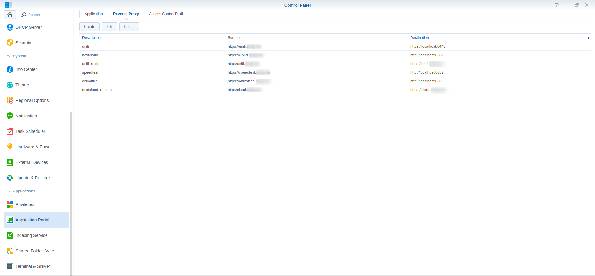

# Docker Compose files for Synology NAS
A collection of Docker Compose files optimized for a Synology NAS.

## How to run docker-compose on your nas

1. Enable SSH on your NAS, you can follow [this guide](https://www.synology.com/en-global/knowledgebase/DSM/tutorial/General_Setup/How_to_login_to_DSM_with_root_permission_via_SSH_Telnet). Make sure you have admin rights to your NAS (sudo).
2. Connect to your Synology NAS over SSH.
3. Installing docker-compose is simple, follow [this official guide from Docker](https://docs.docker.com/compose/install/#install-compose-on-linux-systems).

## General info

1. Don't use the Docker UI in your Synology NAS, only use docker or docker-compose over SSH.
2. It's easy to [bind mount](https://docs.docker.com/storage/bind-mounts/) Docker volumes with your Synology NAS, by this way it's easy to backup your volumes (for example with Hyper Explorer).
3. Bind mounting volumes is depented on your disk configuration. But if you have one volume, in the most cases this volume will be mounted on `/volume1/` on your NAS.

## Putting your Containers behind Synology built-in reverse proxy

Synology NAS has a built-in reverse proxy. It's very easy to put a docker container behind this reverse proxy:

1. Make sure you own a domain (ex. example.com) and you can edit the DNS records.
2. Follow the guide of your registrar and point an A-record to the public IP of your Synology NAS (if you have a dynamic IP, look to enable DDNS).
3. Go to the settings of your NAS and **Application Portal** - **Reverse Proxy** and create an entry.

4. To obtain a certificate for this domain:
   1. Go to **Security** - **Certificates**
   2. Add the certificates for your created domain
        

I use Let's Encrypt certificates and this is working perfect by this way.
   

## Optimized docker-composes

### Ubiquiti Unifi Controller

The UniFi® Software-Defined Networking (SDN) platform is an end-to-end system of network devices across different locations — all controlled from a single interface. 

The Docker image is [jacobalberty/unifi-docker](https://github.com/jacobalberty/unifi-docker).

#### Notes:
* You can run this with a seperate MongoDB container, see the README of this image.
* Sometimes after updates, my Ubiquiti AP, can't find my controller anymore, there is a little trick for this:
  1. Enable SSH access to your Unifi AP.
  2. Execute this command on your Unifi access point
        ```bash
        set-inform http://ip-of-controller:8080/inform
        ```
   3. See [this help page](https://help.ui.com/hc/en-us/articles/204909754-UniFi-Layer-3-methods-for-UAP-adoption-and-management) from Ubiquiti from more adopting options.